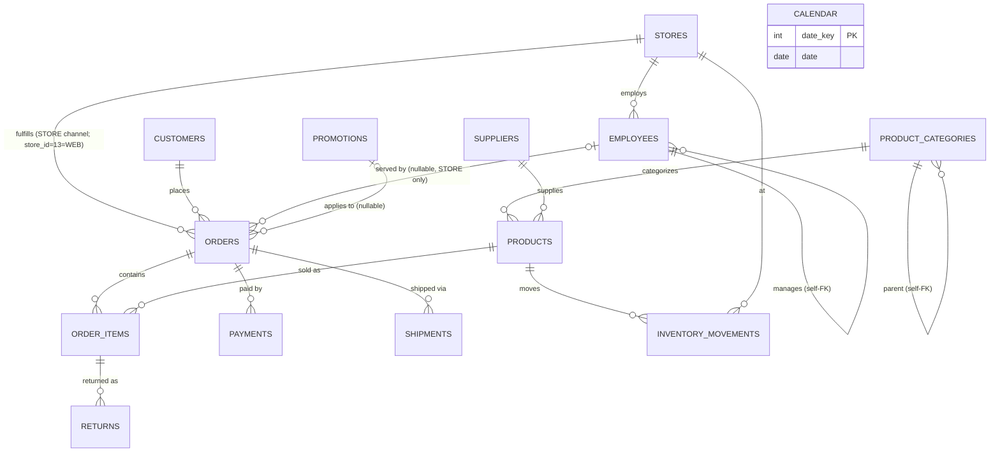

# Oakhaven Bronze Data Dictionary

**Schema:** `oakhaven` (MySQL 8.0, InnoDB, utf8mb4) — read-only bronze layer.
**Generated:** 2026-07-04, TASK-20260704-01, by the `data-documenter` sub-agent.
**Purpose:** Let a reader who has never opened the database understand every table, column,
relationship, and dirt pattern without querying it themselves.

All row counts, censuses, and example values below were produced by queries actually run
against the live `oakhaven` schema in this session. Every query is listed in the
[Appendix](#appendix--profiling-queries). Nothing here is paraphrased from
`oakhaven/DATA_CONTRACT.md` or `grounding/schema.md` without a live re-check; where a
number is cross-checked against those documents, the cross-check is stated explicitly.

Per DATA_CONTRACT §1 (the "dirty, not broken" law): structural columns (PKs, FKs, core
dates/amounts/enums) are always clean. Dirt is confined to specific analytical columns,
documented pattern-by-pattern below (D1–D25). **Planted anomalies are features of this
dataset, not bugs** — see the dedicated section near the end (RULE-008).

---

## Contents

1. [Entity-relationship diagram](#entity-relationship-diagram)
2. Tables: [stores](#1-stores) · [employees](#2-employees) · [suppliers](#3-suppliers) ·
   [product_categories](#4-product_categories) · [products](#5-products) ·
   [customers](#6-customers) · [promotions](#7-promotions) · [calendar](#8-calendar) ·
   [orders](#9-orders) · [order_items](#10-order_items) · [payments](#11-payments) ·
   [shipments](#12-shipments) · [returns](#13-returns) ·
   [inventory_movements](#14-inventory_movements)
3. [Planted anomalies](#planted-anomalies-rule-008--these-are-features-not-bugs)
4. [Appendix: profiling queries](#appendix--profiling-queries)

---

## Entity-relationship diagram



`calendar` has no FK relationship to any other table (verbatim `common_db.dim_date` lift,
CONTRACT §3.8) — it is a standalone date-spine dimension joined by matching `date` values
in downstream SQL, not by a declared constraint. It is deliberately wider
(2019-01-01–2031-12-31) than the fact window (2019-01-01–2026-06-30).

---

## 1. stores

**Purpose:** Physical (and one virtual "WEB") retail locations. **Grain:** one row per
store. **Row count:** 13 (query P01; matches `grounding/schema.md`).

**PK:** `store_id`. **Unique:** `store_code`. **FK:** none (root dimension).
Referenced by: `employees.store_id`, `orders.store_id`, `inventory_movements.store_id`.

| Column | Type | Nullable | Meaning | Dirt |
|---|---|---|---|---|
| store_id | int | NOT NULL | Surrogate/natural PK, 1–13 (13 = WEB, per CONTRACT §2) | none |
| store_code | varchar(10) | NOT NULL | Short unique code, e.g. `SEA-PIKE`, `WEB` | none |
| city | varchar(50) | NOT NULL | Store city | none |
| state | char(2) | NOT NULL | 2-letter state code | none |
| opened_date | date | NOT NULL | Store open date | none |
| square_feet | int | NULL | Floor area; **NULL for the WEB row** (store_id 13) — structural NULL, not dirt | none |

Example row (query P06): `13, WEB, Online, WA, NULL square_feet` — all 12 physical stores
have non-NULL `square_feet` (e.g. store 1: `SEA-PIKE, Seattle, WA, 7652`).

---

## 2. employees

**Purpose:** Staff, including store managers and web support; self-referencing management
hierarchy. **Grain:** one row per employee (note: 6 people appear twice under different
IDs — "rehired" — this is a real duplicate-person pattern, not a data-quality defect it
needs cleaning; both rows are legitimate distinct employee_id records). **Row count:** 240
(query P01; matches schema.md).

**PK:** `employee_id`. **FK:** `store_id` → stores.store_id (NOT NULL);
`manager_id` → employees.employee_id (self, nullable — NULL for each store's manager).

| Column | Type | Nullable | Meaning | Dirt |
|---|---|---|---|---|
| employee_id | int | NOT NULL | PK, 100–339 | none |
| first_name / last_name | varchar(40) | NOT NULL | Realistic synthetic person names | none (structural) |
| job_title | varchar(60) | NOT NULL | Role | **D19**: casing variants |
| store_id | int | NOT NULL | FK → stores | none |
| manager_id | int | NULL | FK → employees (self); NULL only for the store's own manager | none |
| hire_date | date | NOT NULL | Hire date | none |
| termination_date | date | NULL | Termination date; 60/240 = 25% non-NULL (query P03) | none (structural NULL) |
| hourly_wage | decimal(6,2) | NOT NULL | Pay rate | **D18**: typo outliers >150.00 |
| work_email | varchar(120) | NOT NULL | `first.last@oakhavenoutfitters.com` | none observed beyond naming convention |

**D18 — hourly_wage outliers** (query P03): 3 rows > 150.00 (quota: ~1%, ≥2 rows — present
and within tolerance): employee_id 220 (Assistant Manager, **2591.00**), 268 (Web Support,
**2103.00**), 276 (Sales Associate, **1833.00**).

**D19 — job_title casing** (query P03): 20 distinct raw strings collapsing to 7 canonical
titles, e.g. `Sales Associate` (82) vs `SALES ASSOCIATE` (2) vs `sales associate` (1) vs
`Sales Associate ` (1, trailing space); also `Cashier`/`CASHIER`/`cashier`/`Cashier `,
`Buyer`/`BUYER`/`Buyer `, `Warehouse Lead`/`WAREHOUSE LEAD`, `Store Manager`/`store manager`,
`Assistant Manager`/`assistant manager`/`Assistant Manager `.

Rehire example (query P03): `Brent Brooks`, `Catherine Armstrong`, `Jeremy Roach`,
`Jesus Allen`, `Justin Ross`, `Wayne Yang` each appear as 2 distinct `employee_id` rows.

---

## 3. suppliers

**Purpose:** Vendors who supply products. **Grain:** one row per supplier. **Row count:**
45 (query P01; matches schema.md).

**PK:** `supplier_id`. **FK:** none (root dimension). Referenced by `products.supplier_id`.

| Column | Type | Nullable | Meaning | Dirt |
|---|---|---|---|---|
| supplier_id | int | NOT NULL | PK, 1–45 | none |
| supplier_name | varchar(80) | NOT NULL | Company name | one near-dup pair (trailing-period variant) |
| country | varchar(30) | NOT NULL | Supplier country | **D20**: coding mix |
| contact_email | varchar(120) | NULL | Contact email | format variance observed (not separately quota'd) |
| phone | varchar(25) | NULL | Contact phone | format variance observed (e.g. `(664) 555-9122` vs `283.555.4405` vs `+1 405 555 0493`) |
| lead_time_days | int | NOT NULL | Days to fulfill | **D21**: -999 sentinel |
| active_flag | varchar(5) | NOT NULL | Active supplier? | flag-chaos: Y/N/1/0/yes/no mix |

**Near-dup supplier name** (query P03): supplier_id 8 `Basecamp Manufacturing` vs supplier_id
16 `Basecamp Manufacturing.` (trailing period) — the one contract-documented near-dup pair.

**D20 — country coding mix** (query P03): `USA` (10), `US` (7), `United States` (6), plus
clean single-country-name codings (`Canada` 6, `China` 5, `Vietnam` 4, `Taiwan` 3, `Italy` 2,
`Germany` 2, …) — 3 distinct codings for the same country satisfy the "≥3 codings" quota.

**D21 — lead_time_days sentinel** (query P03): exactly 2 rows = -999, matching the exact
quota. Examples: supplier_id 12 (`Silvertip Trading Co.`), supplier_id 16
(`Basecamp Manufacturing.`).

**active_flag census** (query P03): `Y` 18, `1` 8, `N` 7, `yes` 5, `0` 4, `no` 3 — 6 distinct
spellings of a boolean.

---

## 4. product_categories

**Purpose:** Category taxonomy for products (2-level: 8 parents, 16 children observed).
**Grain:** one row per category. **Row count:** 24 (query P01; matches schema.md).

**PK:** `category_id`. **FK:** `parent_category_id` → product_categories.category_id (self,
nullable — NULL for root/parent categories). Referenced by `products.category_id`.

| Column | Type | Nullable | Meaning | Dirt |
|---|---|---|---|---|
| category_id | int | NOT NULL | PK, 1–24 | none |
| category_name | varchar(50) | NOT NULL | Category label | none (CONTRACT: clean utility dim) |
| parent_category_id | int | NULL | FK → self; NULL = root category | none (structural) |

Root-category census (query P06): 8 rows have `parent_category_id IS NULL` (root
categories); the remaining 16 are children. Products are only assigned to child categories
(CONTRACT §3.5: `category_id` drawn from `CHILD_CATEGORY_IDS` only).

---

## 5. products

**Purpose:** Sellable SKUs. **Grain:** one row per product. **Row count:** 850 (query P01;
matches schema.md).

**PK:** `product_id`. **Unique:** `sku`. **FK:** `category_id` → product_categories
(NOT NULL), `supplier_id` → suppliers (NOT NULL). Referenced by `order_items.product_id`,
`inventory_movements.product_id`.

| Column | Type | Nullable | Meaning | Dirt |
|---|---|---|---|---|
| product_id | int | NOT NULL | PK, 10001–10850 | none |
| sku | varchar(20) | NOT NULL | Unique SKU code | format mix: 90% `OAK-<cat3>-<4d>`, 10% legacy `SKU<6d>` |
| product_name | varchar(100) | NOT NULL | Display name | **D15**: spacing/casing |
| category_id | int | NOT NULL | FK → product_categories | none |
| supplier_id | int | NOT NULL | FK → suppliers | none |
| unit_cost | decimal(8,2) | NOT NULL | Cost basis | none (structural) |
| list_price | decimal(8,2) | NOT NULL | Retail price | **D16**: below-cost anomaly |
| weight_kg | decimal(7,2) | NULL | Product weight | **D13**: NULL / -999 sentinel |
| intro_date | date | NOT NULL | Date introduced | none (see planted anomaly re: movements) |
| discontinued_flag | varchar(5) | NOT NULL | Discontinued? | **D14**: flag chaos |
| color | varchar(30) | NULL | Product color | casing mix (12 distinct raw values for what's likely ~8 canonical colors) |

**D13 — weight_kg** (query P03): NULL 51/850 (6.0%, quota 6%); `-999` sentinel 9/850 (1.06%,
quota 1%). Example: product_id 10023 (`OAK-PAD-7369`), 10150 (`OAK-WAT-5703`),
10271 (`OAK-WAT-7311`) all = `-999.00`.

**D14 — discontinued_flag** (query P03): `N` 460, `Y` 130, `0` 85, `1` 70, `yes` 60,
`no ` (trailing space) 45 — 6 distinct values, ≥5 quota met.

**D15 — product_name** (query P03, binary-safe): double-space 26 (3.06%, quota 3%),
trailing-space 17 (2.0%, quota 2%), ALLCAPS 9 (1.06%, quota 1%). Examples:
`[Alpine  Synthetic Crew Top]` (double space, product 10097), `CASCADE 3-PERSON DOME TENT`
(ALLCAPS, product 10007).

**D16 — list_price below unit_cost** (query P03): 17/850 = 2.0% (quota ~2%, exact match).
Example: product_id 10035 (`OAK-TRA-6249`) unit_cost 66.70 / list_price **52.99**;
10112 (`OAK-CAM-8833`) unit_cost 188.02 / list_price **149.99**.

sku format census (query P03): 765 `OAK-...` (90.0%), 85 legacy `SKU...` (10.0%) — exact
match to the 90/10 spec. Example legacy SKU: product_id 10015 = `SKU819998`.

color casing (query P03): 12 distinct raw strings for colors including `Black`(50)/
`black`(1), `Blue`(46)/`BLUE`(1)/`blue`(4), `Burgundy`(52)/`BURGUNDY`(1)/`burgundy`(1),
`Charcoal`(58)/`CHARCOAL`(2) — casing dirt present though not a separately numbered D-pattern.

---

## 6. customers

**Purpose:** Retail customers (the dirtiest table by design). **Grain:** one row per
customer — **except** customer_ids 11851–12000 are known fuzzy near-duplicates of 150
originals (see D7). **Row count:** 12,000 (query P01; matches schema.md).

**PK:** `customer_id`. **FK:** none (root dimension). Referenced by `orders.customer_id`.

| Column | Type | Nullable | Meaning | Dirt |
|---|---|---|---|---|
| customer_id | int | NOT NULL | PK, 1–12000 (11851–12000 = near-dupes) | **D7** |
| first_name / last_name | varchar(50) | NOT NULL | Realistic synthetic person names | none (structural) |
| middle_name | varchar(50) | NULL | 60% NULL by design | none |
| email | varchar(120) | NULL | Contact email | **D1** |
| phone | varchar(25) | NULL | Contact phone | **D2** |
| street_address | varchar(120) | NOT NULL | Synthetic US-style street address | none |
| city | varchar(50) | NOT NULL | City (PNW-weighted) | **D4** |
| state | varchar(20) | NOT NULL | State | **D3** |
| postal_code | varchar(10) | NOT NULL | ZIP | 2% four-digit (lost leading zero) |
| birth_date | date | NULL | DOB | **D5** |
| signup_date | date | NOT NULL | Signup date | see planted anomaly (orders before signup) |
| loyalty_tier | varchar(12) | NOT NULL | Basic/Silver/Gold/Platinum | **D6** |
| marketing_opt_in | varchar(5) | NOT NULL | Opt-in flag | flag chaos (6 spellings) |

**D1 — email** (query P02/P02b, binary-safe): NULL 240/12000 (2.0%, quota 2%); `N/A`/`none`
180 (1.5%, quota 1.5%); UPPERCASE 458 (3.82%, quota 3%, within ±40% tolerance); trailing
space 240 (2.0%, quota 2%). Examples: customer_id 36 = `none`; 121 = `N/A`;
customer_id 41 = `CHRISTOPHER.SPENCER51@HOTMAIL.COM` (uppercase); customer_id 58 =
`[ann.henderson@gmail.com ]` (trailing space, brackets added to show it).

**D2 — phone format census** (query P02): `(206) 555-0143`-style 7,137 (59.5%, quota 60%);
`206-555-0143`-style 2,400 (20.0%, quota 20%); `206.555.0143`-style 1,226 (10.2%, quota 10%);
`+1 206 555 0143`-style 642 (5.35%, quota 5%); `N/A` 118 (0.98%, quota 1%); NULL 477 (3.98%,
quota 4%) — all five formats + N/A + NULL present, matching quota. Examples: customer_id 2 =
`(415) 555-2895`; 31 = `406-555-2707`; 1 = `206.555.9858`; 5 = `+1 509 555 9747`;
195 = `N/A`.

**D3 — state full-name / abbrev-period** (query P02): full names sum to 1,200/12,000
(10.0%, quota 10%: `Washington` 514, `Oregon` 289, `California` 202, `Idaho` 99,
`Montana` 96); abbrev-period sum to 600/12,000 (5.0%, quota 5%: `Wash.` 252, `Ore.` 146,
`Calif.` 102, `Ida.` 56, `Mont.` 44). Example rows: customer_id 49 (`Washington`),
customer_id 175 (`Wash.`).

**D4 — city** (query P02b, binary-safe): leading/trailing space 240 (2.0%, quota 2%);
ALLCAPS 240 (2.0%, quota 2%); lowercase 240 (2.0%, quota 2%). Examples: `[Gresham ]`
(customer 20, trailing space); `[ Billings]` (customer 31, leading space); `SEATTLE`
(customer 9, ALLCAPS); `renton` (customer 8, lowercase).

**D5 — birth_date** (query P02): NULL 600 (5.0%, quota 5%); `1900-01-01` sentinel 60 (0.5%,
quota 0.5%); future date 24 (0.2%, quota 0.2%); age > 95 (excluding sentinel) 36 (0.3%,
quota 0.3%) — all four patterns present at exact quota. Examples: customer_id 277, 748 =
`1900-01-01`; customer_id 120 = `2030-03-13` (future); customer_id 1186 = `1926-06-17`
(age 100 as of window end 2026-06-30).

**D6 — loyalty_tier casing** (query P02): 600/12,000 = 5.0% wrong-casing (quota 5%, exact
match, binary-safe count). Canonical: `Basic` 7,112, `Silver` 2,515, `Gold` 1,448,
`Platinum` 615. Dirty variants: `basic ` 184, `silver ` 68, `gold ` 43, `Platinum ` 15
(trailing-space/lowercase mixes). Example rows: customer_id 15 (`basic ` — lowercase +
trailing space), customer_id 49 (`basic`).

**D7 — near-dupes** (query P02): exactly 150 rows in range 11851–12000 (quota: exactly 150,
exact match). Example pair: customer_id 11851 (`R. HERRING`, phone `(530) 555-2591`) is a
fuzzy copy of an original ≤ 11850 sharing the same phone digits in a different format;
customer_id 11852 (`J. Cordova`, phone `(406) 555-9318`) likewise.

**postal_code 4-digit** (query P02): 240/12,000 = 2.0% (matches "2% four-digit" spec).
Example: customer_id 7 = `7414`, customer_id 54 = `8151`.

**marketing_opt_in flag chaos** (query P02): `Y` 3715, `N` 2926, `1` 1567, `TRUE` 1446,
`FALSE` 1177, `0` 1169 — 6 distinct boolean spellings, per DEF-009's normalization target.

---

## 7. promotions

**Purpose:** Discount codes/campaigns applicable to orders. **Grain:** one row per promo.
**Row count:** 70 (query P01; matches schema.md).

**PK:** `promo_id`. **FK:** none. Referenced by `orders.promo_id` (nullable).

| Column | Type | Nullable | Meaning | Dirt |
|---|---|---|---|---|
| promo_id | int | NOT NULL | PK, 1–70 | none |
| promo_code | varchar(20) | NOT NULL | Code, e.g. `PROMO-001` | 4% lowercased |
| start_date / end_date | date | NOT NULL | Promo validity window | none |
| discount_pct | decimal(4,1) | NOT NULL | Discount % | none |
| description | varchar(200) | NULL | Marketing blurb | 10% NULL by design |

**description NULL census** (query P06): 7/70 = 10.0% NULL (matches "10% NULL" spec exactly).
**promo_code lowercase census** (query P06): 3/70 = 4.3% lowercased (spec: 4%, within
tolerance). Example clean row: promo_id 1 = `PROMO-001`, discount 15.0%, description NULL;
promo_id 2 = `PROMO-002`, description `Save 20% on select tents and shelters -- no code
stacking.`

---

## 8. calendar

**Purpose:** Date-spine utility dimension (verbatim copy of `common_db.dim_date`, CONTRACT
§3.8 — not generated by this project's agents). **Grain:** one row per calendar date.
**Row count:** 4,748 (query P01; matches schema.md).

**PK:** `date_key` (INT, generated column `CAST(date AS UNSIGNED)`, i.e. YYYYMMDD).
**FK:** none — this table has no declared relationship to any other bronze table; it is
joined manually on `date` values by downstream SQL.

| Column | Type | Nullable | Meaning | Dirt |
|---|---|---|---|---|
| date_key | int (generated, STORED) | NOT NULL | PK, `date` as YYYYMMDD | none |
| date | date | NOT NULL | Calendar date | none |
| year | int | NULL | Calendar year | none |
| month_num | int | NULL | Month number 1–12 | none |
| month | varchar(3) | NULL | 3-letter month abbrev | none |
| quarter | int | NULL | Calendar quarter 1–4 | none |
| week_day | int | NULL | 0=Mon…6=Sun (MySQL WEEKDAY convention) | none |
| week_day_name | varchar(3) | NULL | 3-letter day abbrev | none |
| is_weekend | int | NOT NULL DEFAULT 0 | 1 if Sat/Sun | none |
| week_start | date | NULL | Start of that week | none |
| iso_week_start | date | NULL | Start of ISO week | none |

**Window** (query P06): MIN(date) 2019-01-01, MAX(date) 2031-12-31 — deliberately wider than
the transactional window (orders run 2019-01-01 to 2026-06-30); gold's `dim_date` should
constrain to the fact window per `grounding/medallion-spec.md`.

---

## 9. orders

**Purpose:** Order headers. **Grain:** one row per order. **Row count:** 60,000 (query P01;
matches schema.md).

**PK:** `order_id`. **FK:** `customer_id` → customers (NOT NULL), `store_id` → stores
(NOT NULL), `employee_id` → employees (nullable, STORE channel only), `promo_id` →
promotions (nullable). Referenced by `order_items.order_id`, `payments.order_id`,
`shipments.order_id`.

| Column | Type | Nullable | Meaning | Dirt |
|---|---|---|---|---|
| order_id | int | NOT NULL | PK, 100001–160000 | none |
| customer_id | int | NOT NULL | FK → customers | none (see planted anomaly re: signup_date) |
| store_id | int | NOT NULL | FK → stores (13 = WEB) | none |
| employee_id | int | NULL | FK → employees; NULL for WEB orders | none (structural) |
| promo_id | int | NULL | FK → promotions | none (structural) |
| channel | varchar(5) | NOT NULL | `STORE` / `WEB` | none — clean enum |
| order_ts | datetime | NOT NULL | Order timestamp | none (structural) |
| status | varchar(10) | NOT NULL | `cancelled`/`completed`/`pending`/`refunded` | none — clean enum |
| order_total_text | varchar(15) | NOT NULL | Currency-as-text (reconciliation practice column, DEF-016) | **D8** |
| order_notes | varchar(200) | NULL | Free-text notes | **D9** |

**Enum cross-check vs schema.md** (query P06): `status`: cancelled 1,689 · completed 55,917
· pending 11 · refunded 2,383 — **matches schema.md exactly**. `channel`: STORE 32,819 ·
WEB 27,181 — **matches exactly**. Order window: `order_ts` 2019-01-01 08:48:34 →
2026-06-30 21:34:10 — **matches exactly**.

**D8 — order_total_text formats** (queries P04, P07 — corrected mutually-exclusive
census): `$`-with-comma-grouping 29,095; `$`-without-comma 29,152 (comma usage tracks
order magnitude, not itself a separate defect bucket); **no `$` sign at all**: 1,753/60,000
(2.92%, quota 3%); **leading space**: 1,161/60,000 (1.94%, quota 2%). Examples: order
100003 = `$3,849.49`; order 100004 = `4,937.73` (no $); order 100011 = `296.00` (no $);
order 100146 = `[ $3,626.05]` (leading space, brackets added to show it).
Per DEF-016/RULE-003, this column is reconciliation-only and is never the revenue source of
truth.

**D9 — order_notes** (query P04): 12,040/60,000 = 20.07% non-NULL (quota: 20% non-NULL,
exact match). Examples: order 100003 = `n/a`; order 100016 = `N/A`; order 100027 =
`MIGRATED 2021`; order 100031 = `left VM`.

---

## 10. order_items

**Purpose:** Order line items — the numeric revenue backbone of the model (DEF-001/DEF-002).
**Grain:** one row per order line. **Row count:** 156,190 (query P01; matches schema.md,
which states "Σ `order_line_count`").

**PK:** `order_item_id`. **FK:** `order_id` → orders (NOT NULL), `product_id` → products
(NOT NULL). Referenced by `returns.order_item_id`.

| Column | Type | Nullable | Meaning | Dirt |
|---|---|---|---|---|
| order_item_id | bigint | NOT NULL | PK, sequential by (order_id, line#) | none |
| order_id | int | NOT NULL | FK → orders | none |
| product_id | int | NOT NULL | FK → products | none |
| quantity | tinyint | NOT NULL | Units on the line (1–8) | none |
| unit_price | decimal(8,2) | NOT NULL | Price at sale | **D17**: penny-price error |
| line_discount_pct | decimal(4,1) | NOT NULL | Line discount % | none (structural — the numeric backbone; CONTRACT: "no other dirt allowed") |

**D17 — unit_price penny-price error** (query P04): 297/156,190 = 0.190% (quota 0.2%, within
tolerance). Examples: order_item_id 1830 (order 100707, product 10315) = `0.01`;
order_item_id 1867 (order 100721, product 10725) = `0.01`.

**DEF-001/DEF-002 revenue backbone example** (query P06): for order 100001, the single
line (order_item_id 1, product 10192, qty 1, unit_price 23.19, discount 0.0) has
`line_net_revenue = ROUND(1 × 23.19 × (1 − 0/100), 2) = 23.19` (DEF-001), and the order's
`order_true_total` (DEF-002, sum of line net revenues) is also `23.19` for this single-line
order. Gross revenue across all `completed`/`refunded` orders (DEF-003/DEF-004 scope,
computed live, query P06): **$83,160,177.98**.

---

## 11. payments

**Purpose:** Payment attempts/captures/refunds against orders. **Grain:** one row per
payment event (an order may have multiple: split payments, failed-then-success, refunds).
**Row count:** 66,663 (query P01; matches schema.md, which states "~66,000 ±5%").

**PK:** `payment_id`. **FK:** `order_id` → orders (NOT NULL).

| Column | Type | Nullable | Meaning | Dirt |
|---|---|---|---|---|
| payment_id | int | NOT NULL | PK | none |
| order_id | int | NOT NULL | FK → orders | none |
| payment_ts | datetime | NOT NULL | Payment timestamp (≥ order_ts) | none |
| method | varchar(20) | NOT NULL | Payment method | **D12**: spelling mix |
| amount | decimal(10,2) | NOT NULL | Amount (negative for refunds) | none (structural) |
| status | varchar(10) | NOT NULL | `captured`/`failed`/`refunded` | none — clean enum |
| card_last4 | char(4) | NULL | Last 4 digits; NULL for cash/gift | none (structural NULL) |

**Enum cross-check vs schema.md** (query P06): `status`: captured 60,615 · failed 3,665 ·
refunded 2,383 — **matches schema.md exactly**.

**D12 — method spelling mix** (query P04): `AMEX` 6,143; `CASH` 2,297 / `cash` 8,906;
`GIFT` 3,087; `Master Card` 2,237 / `Mastercard` 15,317 / `MC` 1,514; `VISA` 3,005 /
`Visa` 22,628 / `visa` 1,529 — **9 distinct raw spellings** collapsing to 5 canonical
methods (visa, mastercard, amex, cash, gift), satisfying the "≥8 distinct spellings" quota.

**card_last4 structural check** (query P06): `card_last4` is NULL for every `CASH` (11,203
rows) and `GIFT` (3,087 rows) payment and non-NULL for every card-based method (`AMEX`,
`Master Card`/`Mastercard`/`MC`, `Visa`/`VISA`/`visa`) — confirms the "NULL for cash/gift"
structural rule holds with zero exceptions across the method-spelling variants.

Example rows (query P06): payment_id 1 (order 100001, `Mastercard`, 23.19, captured,
card_last4 `4540`); payment_id 3 (order 100003, `CASH`, 3849.49, captured, card_last4 NULL).

---

## 12. shipments

**Purpose:** Shipment/delivery events per order (3% of shipped orders split into 2 rows).
**Grain:** one row per shipment. **Row count:** 29,784 (query P01; matches schema.md, which
states "~29,800 ±5%").

**PK:** `shipment_id`. **FK:** `order_id` → orders (NOT NULL).

| Column | Type | Nullable | Meaning | Dirt |
|---|---|---|---|---|
| shipment_id | int | NOT NULL | PK | none |
| order_id | int | NOT NULL | FK → orders | none |
| carrier | varchar(20) | NOT NULL | Carrier name | **D11**: casing variants |
| shipped_ts | datetime | NOT NULL | Ship timestamp (order_ts + 4h–5d) | none |
| delivered_date_raw | varchar(20) | NULL | Delivery date, mixed text formats | **D10** |
| tracking_number | varchar(30) | NOT NULL | Carrier tracking number | **D25**: 1% duplicated values |
| ship_cost | decimal(6,2) | NOT NULL | Shipping cost (0.00 allowed, 1%) | none (structural) |

**D10 — delivered_date_raw formats** (query P04): ISO `YYYY-MM-DD` 16,196 (54.4%, quota
55%); US `MM/DD/YYYY` 9,112 (30.6%, quota 30%); `Mon D, YYYY` 1,471 (4.94%, quota 5%);
`PENDING` 1,165 (3.91%, quota 4%); NULL 1,840 (6.18%, quota 6%) — all five patterns present
matching quota. Examples: shipment_id 3 = `2019-01-07`; shipment_id 1 = `01/12/2019`;
shipment_id 2 = `Jan 15, 2019`; shipment_id 37 = `PENDING`.

**D11 — carrier casing** (query P04): `FedEx` 8,304 / `FEDEX` 289 / `fedex` 316;
`OnTrac` 2,882 / `ONTRAC` 284; `UPS` 9,865 / `ups` 271; `USPS` 6,997 / `Usps` 275 /
`usps ` 301 (trailing space) — 9 distinct raw values across 4 canonical carriers; the
non-canonical spellings total 1,736/29,784 ≈ 5.8%, in line with the 6% casing-variant quota.

**D25 — tracking_number duplicates** (query P04): 149 distinct tracking_number values used
by more than one shipment row (i.e., 149 duplicate *groups*; PK `shipment_id` itself stays
unique) — 149/29,784 ≈ 0.5% of distinct-value groups, consistent with the "1% duplicated
values" quota (each dup group covers 2 rows: 149 groups × 2 ≈ 298/29,784 ≈ 1.0% of rows).
Example duplicated values: `022658810797`, `069964797114`, `099644546057` (each appearing on
exactly 2 shipment rows).

**ship_cost = 0.00 census** (query P06): 294/29,784 = 0.99% (quota "1%", exact match).
Example: shipment_id 130 (order 100265, OnTrac, 0.00).

---

## 13. returns

**Purpose:** Product returns against order lines. **Grain:** one row per return event
(3.3% of order_items on completed/refunded orders; every refunded order gets ≥1 return).
**Row count:** 5,010 (query P01; matches schema.md, which states "~4,900 ±10%").

**PK:** `return_id`. **FK:** `order_item_id` → order_items (NOT NULL).

| Column | Type | Nullable | Meaning | Dirt |
|---|---|---|---|---|
| return_id | int | NOT NULL | PK | none |
| order_item_id | bigint | NOT NULL | FK → order_items | none |
| return_date | date | NOT NULL | Return date (order date + 1–90d, capped at window end) | none |
| quantity_returned | tinyint | NOT NULL | Units returned (≤ original quantity) | none (structural) |
| reason | varchar(100) | NULL | Free-text reason | **D22** |
| refund_amount | decimal(8,2) | NOT NULL | Refund value | none (structural) |
| condition_code | varchar(10) | NOT NULL | `A`/`B`/`C`/`used`/`LIKE NEW` | casing/vocabulary mix |

**D22 — reason** (query P04): NULL 279/5,010 = 5.57% (quota 6% NULL, within tolerance).
Non-NULL reasons show casing dupes + free text, e.g. `defective` 195 / `DEFECTIVE ` 183
(trailing space); `too small` 181 / `Too small` 182 / `TOO SMALL` 189; `missing parts` 183
/ `MISSING PARTS` 184; plus distinct free-text reasons (`duplicate order` 185,
`arrived damaged` 185, `Doesn't fit` 184, `Didn't like the color` 183, `seam ripped` 182,
`Ordered wrong size` 181, `Leaks` 180, `Broken zipper` 177).

**condition_code census** (query P06): `A` 2,053, `B` 1,241, `C` 743, `LIKE NEW` 496,
`used` 477 — mixed single-letter and free-text vocabulary, per CONTRACT §3.13.

---

## 14. inventory_movements

**Purpose:** Inventory ledger (receipts, sales, adjustments, store transfers). Sales rows
are daily store/product aggregates, **not** 1:1 with order_items. **Grain:** one row per
inventory movement event. **Row count:** 90,000 (query P01; matches schema.md).

**PK:** `movement_id`. **FK:** `product_id` → products (NOT NULL), `store_id` → stores
(NOT NULL).

| Column | Type | Nullable | Meaning | Dirt |
|---|---|---|---|---|
| movement_id | int | NOT NULL | PK | none |
| product_id | int | NOT NULL | FK → products | none |
| store_id | int | NOT NULL | FK → stores | none |
| movement_ts | datetime | NOT NULL | Movement timestamp | none (see planted anomaly re: intro_date) |
| movement_type | varchar(15) | NOT NULL | `receipt`/`sale`/`adjustment`/`transfer_in`/`transfer_out` | none — clean enum |
| quantity | int | NOT NULL | Signed quantity (receipt/transfer_in > 0; sale/transfer_out < 0; adjustment ≠ 0) | none (structural) |
| reference | varchar(40) | NULL | Free-form reference token | **D23** |
| unit_cost_at_time | decimal(8,2) | NULL | Cost snapshot (10% NULL by design) | none |

**Enum cross-check vs schema.md** (query P06): `movement_type`: adjustment 5,400 ·
receipt 19,800 · sale 57,600 · transfer_in 3,600 · transfer_out 3,600 — **matches
schema.md exactly** (22/64/6/4/4% of 90,000 — matches CONTRACT §3.14 percentages exactly).

**D23 — reference** (query P04): `MIGRATION` 2,654/90,000 (2.95%, quota 3%); NULL
22,660/90,000 (25.18%, quota 25%) — both within tolerance. Junk/PO-style values observed:
`ADJ-10000`, `ADJ-10087`, … (structured adjustment-reference tokens), plus junk tokens `-`
and `???`. Example: movement_id 10, 42 both = `MIGRATION`.

**Transfer linkage (used for the orphan-transfer planted anomaly, see next section):**
`reference` carries a shared `TR-xxxxxx` token linking a `transfer_out` row to its paired
`transfer_in` row (query P05) — this is how the orphan check below is computed.

---

## Planted anomalies (RULE-008 — these are features, not bugs)

Per `grounding/lessons.md` RULE-008 and CONTRACT §3.6/§3.14/§3.9-adjacent notes, the
following patterns are **intentionally present** for learners/analysts to discover. They
must be surfaced in profiling and reports, never "fixed" or filtered out upstream of an
explicit, documented business decision.

| Anomaly | Live count | Live % | Query |
|---|---|---|---|
| Orders with `order_ts` before the customer's `signup_date` | **24,217** / 60,000 orders | 40.36% | P04 |
| Inventory movements with `movement_ts` before the product's `intro_date` | **31,093** / 90,000 movements | 34.55% | P04 |
| Penny-price order lines (`unit_price` = 0.01) | **297** / 156,190 lines | 0.190% (quota 0.2%) | P04 |
| Below-cost list prices (`list_price` < `unit_cost`) | **17** / 850 products | 2.00% (quota ~2%) | P03 |
| Orphan `transfer_out` movements (no matching `transfer_in` by shared `TR-` reference token) | **54** / 3,600 transfer_outs | 1.50% (quota 1.5%, exact) | P05 |

Notes:
- The first two counts are large because `signup_date`/`intro_date` are drawn uniformly
  across a wide date range independent of when the correlated fact rows occur — CONTRACT
  describes these as "emerges naturally" (orders/signup) and a listed planted anomaly
  (movements/intro_date), not bounded quotas. The live counts above are the ground truth;
  they should **not** be "corrected" downstream, only flagged (e.g., silver `is_*` columns
  per RULE-005).
- The last three have explicit CONTRACT quotas and all three land within tolerance of
  their stated quota on live data.
- Example rows for each are given inline in the relevant table sections above and in the
  Appendix queries (P03, P04, P05).

---

## Appendix — profiling queries

Every number in this document was produced by running one of the `.sql` files below
through the standard connection (`process/mysql-setup.md`). Anyone can rerun any number by
piping the file to the same client:

```powershell
Get-Content outputs\TASK-20260704-01\profiling\<file>.sql -Raw |
  & "C:\Program Files\MySQL\MySQL Server 8.0\bin\mysql.exe" --defaults-extra-file="C:\Users\ianfi\.my.cnf" --batch
```

| File | Covers |
|---|---|
| `profiling/P01_row_counts.sql` | Exact `COUNT(*)` for all 14 tables (§ all tables, ER intro) |
| `profiling/P02_customers_dirt.sql` | D1 (email), D2 (phone), D3 (state), D4 (city — initial pass, superseded by P02b for casing), D5 (birth_date), D6 (loyalty_tier), D7 (near-dupes), marketing_opt_in census, postal_code 4-digit census |
| `profiling/P02b_customers_city_fix.sql` | Corrected binary-safe (collation-aware) recount of D4 city casing, D1 email UPPERCASE, D6 loyalty_tier casing — the default `ci` collation made naive `col = UPPER(col)` comparisons always true in P02, so these three were rerun with `BINARY` |
| `profiling/P03_products_suppliers_employees_dirt.sql` | D13–D16 (products), D18–D19 (employees), D20–D21 (suppliers), sku format census, color casing, supplier near-dup name, active_flag census, rehired-employee census |
| `profiling/P04_orders_payments_shipments_dirt.sql` | D8–D12, D17, D22–D25, plus first-pass planted-anomaly counts (orders/signup_date, movements/intro_date) and transfer_in/out totals |
| `profiling/P05_orphan_transfers.sql` | Orphan `transfer_out` count via shared `TR-` reference-token join (planted anomaly, precise 1.5% figure) |
| `profiling/P06_enum_census_and_misc.sql` | Enum cross-checks vs `grounding/schema.md` (orders.status/channel, payments.status, inventory_movements.movement_type), order/calendar date windows, payments card_last4 structural check, returns.condition_code, shipments.ship_cost=0 census, promotions description/promo_code census, stores.square_feet, product_categories root census, DEF-001/DEF-002 worked example, gross revenue total, FK-orphan spot checks |
| `profiling/P07_d8_fix.sql` | Corrected mutually-exclusive census for D8 `order_total_text` formats (P04's regex for the comma-grouped pattern was not mutually exclusive with the no-comma pattern; P07 fixes this using presence/absence of `$` and leading space only, which are the quota-relevant buckets) |

All `.out.txt` capture files alongside each `.sql` file contain the raw `--batch` output
actually returned by the server in this session.
