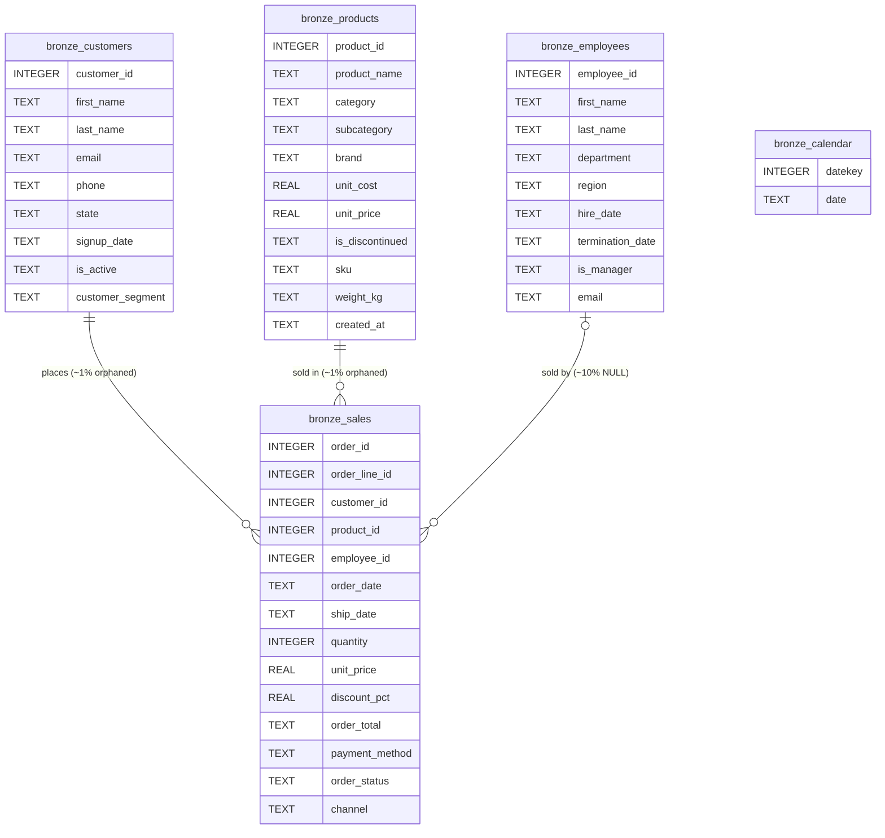
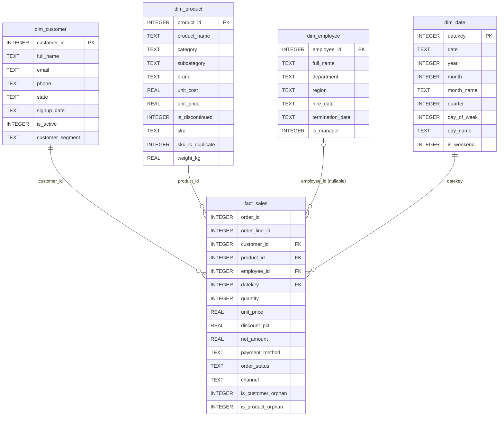

# Oakhaven — Entity Relationship Diagrams

Two diagrams: the raw bronze layer (no declared constraints — that's
deliberate, see `data_dictionary.md`) and the business-ready gold star
schema built on top of it via the silver cleaning layer.

Note: bronze has **no actual foreign keys** in the database (SQLite
enforces nothing here). The relationships below are the *intended*
ones, made real only after the silver/gold layers standardize types
and formats. Bronze also contains intentional orphan FKs
(`bronze_sales.customer_id` / `product_id` pointing at nonexistent
rows) and duplicate people/SKUs — the diagram shows the logical
relationship, not a guarantee that every row honors it.

## Bronze layer (raw, messy)

## Gold layer (star schema, business-ready)

`fact_sales` grain = one row per order line. It carries FK columns to
all four dimensions but does **not** join to them internally — join
`fact_sales` to a dim view when you need that dimension's attributes.
`is_customer_orphan` / `is_product_orphan` flag the ~1% of rows whose
FK doesn't resolve against `dim_customer` / `dim_product`; `datekey`
is NULL when `order_date` itself was NULL in bronze (~0.5% of rows).
